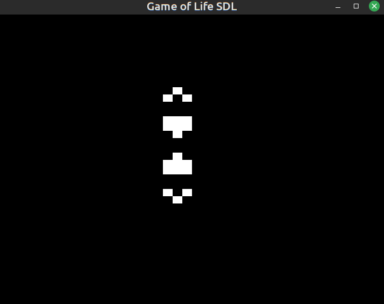

# Conway's Game of Life in C

An implementation of Conway's game of life in C using SDL or ncurses (WIP).  
Might get rid of ncurses as it is annoying   

What it looks like for now :  

## How to use:
 - Escape to quit
 - C to clear the grid of any live cell
 - Space to pause/resume the game

## Possible ameliorations :
 - Make the neighbors array's size change depending on how many neighbors a cell has
 - Make the grid "infinite"
 - Make the window resizable and the grid expend with it
 - Add a zoom/dezoom
 - Add a key that clears the whole grid of any live cell
 - Implement a mode for the console if possible

